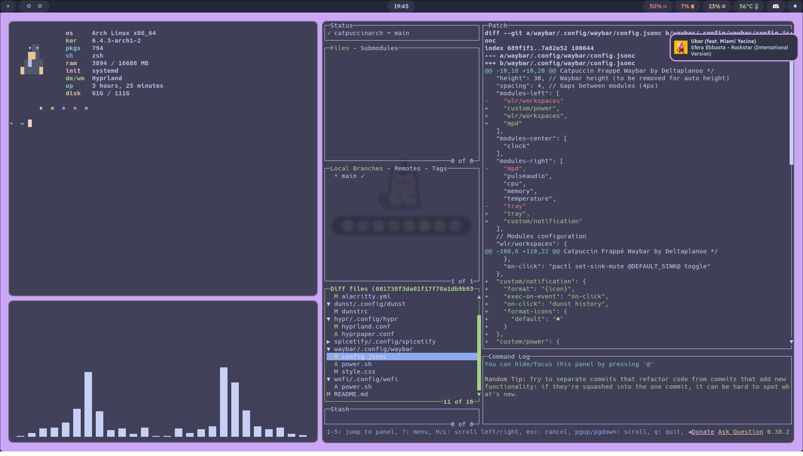

# My Catppuccin themed Hyprland rice.

### Setup
Stow usage:
  - **stow a package to your .configs**:
  cd into HyprCat dir and use `stow -S pkgname` changing pkgname with the name of the package you want to stow in your `~/.config`
  - **add new package to your folder**:
    - `mkdir -p ~/HyprCat/pkgname/.config/pkgname`
    - `mv ~/.config/pkgname/* ~/HyprCat/pkgname/.config/pkgname`
    - `cd ~/HyprCat`
    - and finally `stow -S pkgname`

### TODOs
- [ ] Hyprland
  - [x] change window border color
  - [x] lockscreen
    - [ ] time on lockscreen
  - [x] copy screenshot
- [x] Hyprpaper
- [x] Waybar
  - [ ] add mpd (i think i have to compile the version that supports it)
  - [x] add notifications via dunst history
- [ ] Kitty
  - [ ] ?
- [x] Wofi
  - [x] custom launcher colors
  - [x] power menu
- [ ] Neovim
  - [x] Lazy
  - [x] maps
  - [x] telescope
  - [ ] alpha
  - [ ] filetree
- [x] System clock
- [x] Stow
- [ ] Dunst
  - [x] custom colors
  - [x] rounded border
  - [ ] notification history on waybar  #FIXME: dunst history not working
- [ ] Grub
- [x] Spicetify
- [x] Discord
- [ ] Nautilus
